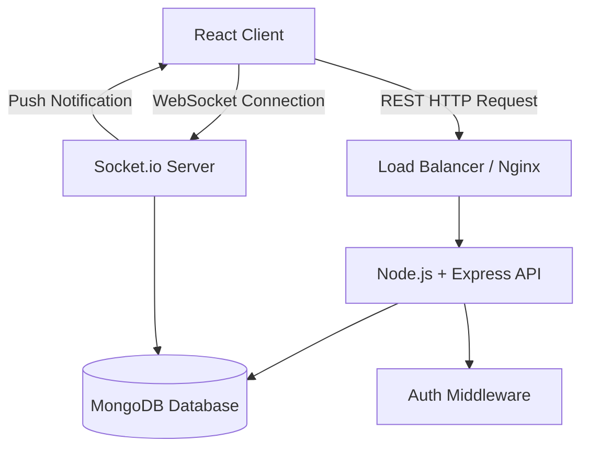
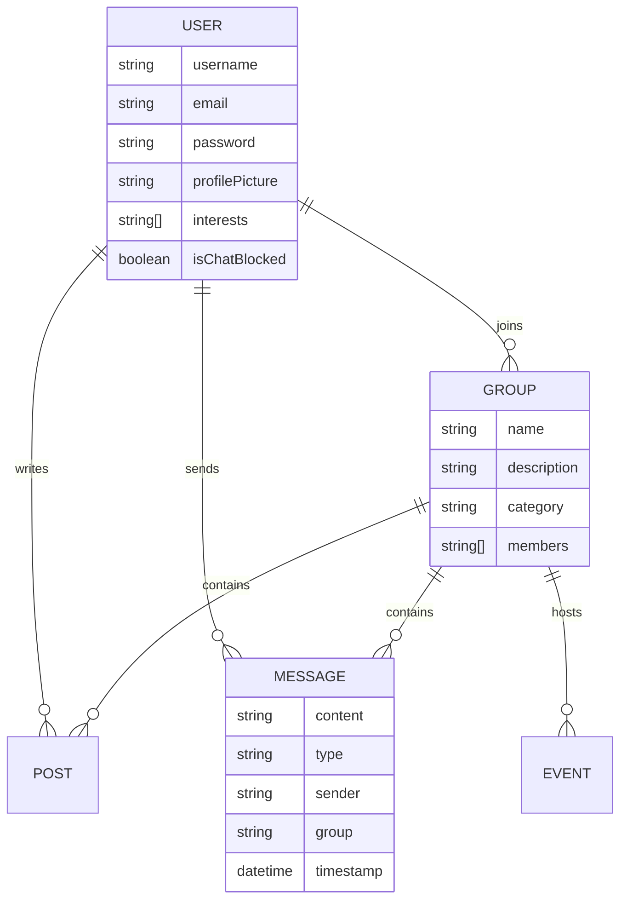
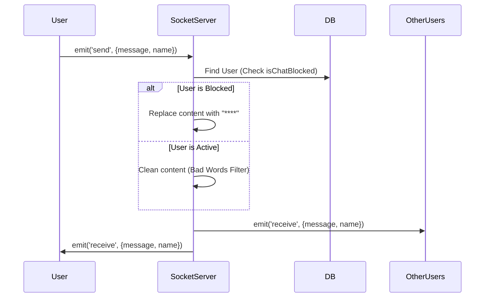

# HobbyHub Backend Architecture Presentation

## Slide 1: Title Slide
**Project:** HobbyHub Backend
**Subtitle:** Scalable Real-Time Community Platform
**Presenter:** [Your Name]
**Focus:** MERN Stack Architecture & Real-Time Data Flow

---

## Slide 2: The Problem
**Why do we need another platform?**

*   **WhatsApp / Telegram:** Great for messaging, but **lack event management** and community discovery. Group chats get chaotic and keeping track of RSVPs is impossible.
*   **Discord / Reddit:** Powerful but **too complex** (`tech-savvy`) for the casual hobbyist. The initial learning curve drives non-technical users away.
*   **Facebook Groups:** Cluttered with ads and algorithm-driven content, making it hard to foster genuine real-time connections.

---

## Slide 3: The Solution - HobbyHub
**A dedicated space for passions.**

*   **Simplified Experience:** Easy-to-use interface designed for everyone, not just gamers or devs.
*   **Event-Centric:** Built-in tools to schedule meetups, workshops, and contests directly within groups.
*   **Real-Time Connection:** Instant audio/visual feedback (Socket.io) makes the platform feel alive.
*   **Safe Community:** Proactive moderation tools to keep the environment friendly and focused.

---

## Slide 4: Technology Stack
*   **Runtime Structure:** Node.js + Express.js
*   **Database:** MongoDB (NoSQL) with Mongoose ODM
*   **Real-Time Engine:** Socket.io (Bi-directional events)
*   **Authentication:** JWT (JSON Web Tokens) + BCrypt
*   **File Storage:** Multer (Local/Server-side uploads)

---

## Slide 5: Frontend Architecture
**Description:** 
A responsive, interactive UI built to handle real-time state updates efficiently.

*   **Framework:** React (Vite)
*   **Styling:** Custom CSS Variables + Glassmorphism Design
*   **State Management:**
    *   `useState` / `useEffect`: For local component state.
    *   `Socket.io-client`: For listening to global events (messages, notifications).
*   **Key Libraries:**
    *   `react-router-dom`: SPA Client-side routing.
    *   `lucide-react`: Modern vector icons.
    *   `framer-motion`: Smooth animations for onboarding and page transitions.

---

## Slide 6: High-Level System Architecture
**Description:**
A streamlined interface between Client, Server, and Database, with a parallel WebSocket channel for instant updates.

---

## Slide 7: Database Schema (ER Diagram)
**Description:**
Core relationships between Users, Groups, and content types like Posts and Messages.

---

## Slide 8: Real-Time Global Chat Flow
**Description:**
Sequence of events when a user sends a message in the Global Chat, showing the blocking/moderation check.

---

## Slide 9: API Endpoint Structure
**Organized by Resource:**

*   **Auth** (`/api/auth`)
    *   `POST /register`: Create new user
    *   `POST /login`: Generate JWT
    *   `GET /me`: Validate Token & Get Profile

*   **Users** (`/api/users`)
    *   `GET /`: List all users (Admin)
    *   `PUT /profile`: Update Avatar/Bio
    *   `PUT /:id/block`: Toggle Chat Block (Admin)

*   **Groups** (`/api/groups`)
    *   `GET /`: Browse all groups
    *   `POST /`: Create new group
    *   `POST /:id/join`: Join a group

---

## Slide 10: Security & Scalability
**Security:**
*   **Passwords:** Hashed via `bcryptjs` before storage.
*   **Tokens:** JWT for stateless authentication.
*   **Validation:** Input sanitization on server-side.
*   **Moderation:** Admin controls + Profanity filters on sockets.

**Scalability Plans:**
*   **Redis Adapter:** For Socket.io scaling across multiple nodes.
*   **S3 Integration:** Move file uploads from local disk to Cloud Storage.
*   **Microservices:** Separate Chat Service from Core API.

---

## Slide 11: End
**Thank You!**
*Questions?*
